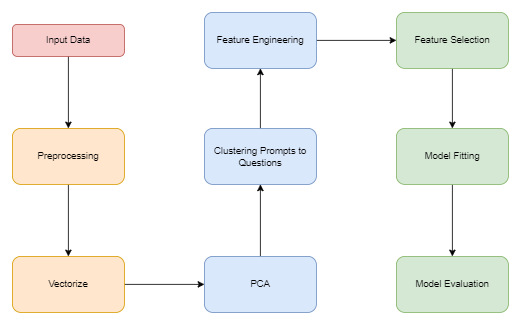

# CS 412 CONGABONGAZONGA BROJECT

## Table Of Contents
### [1. Overall Structure] (#overall)
### [2. Main Contributions to the Project] (#maincon)
#### [2.1 Clustering for Prompt Matching] (#clustering1)
#### [2.2 Preprocessing] (#preprocessing1)
#### [2.3 Keyword Lists] (#keyword)
#### [2.4 Sentiment and Readability Scores] (#sentiment1)
#### [2.5 Vectorization Techniques] (#vec)
#### [2.6 Dimensionality Reduction with PCA] (#dimred)
### [3. Preprocessing] (#preprocessing2)
### [4. Vectorizer] (#vec2)
### [5. PCA] (#pca)
### [6. Clustering] (#clustering2)
### [7. Feature Engineering] (#feature)
#### [7.1 Sentiment Scores] (#sentiment2)
#### [7.2 Readability Scores] (#read)
#### [7.3 Whitelist / Blacklist Words] (#whiteblack)
### [8. Feature Selection] (#featuresel)
### [9. Model Fitting & Evaluation] (#modelfit)
### [10. Results & Analysis] (#results)

## 1. Overall Structure <a name="overall"/>

The project's architecture is illustrated in the following schema:

This diagram demonstrates the different steps of the project we followed in order to come up with this system. 

## 2. Main Contributions to the Project <a name="userdoc"/>

### 2.1 Clustering for Prompt Matching <a name="clustering1"/>

In contrast to the existing approach, which relied on cosine similarity for prompt-matching, we adopted clustering algorithms. This involved experimenting with various clustering algorithms, such as K-Means, DBScan, and GMM, to determine the most effective method for our specific problem.

### 2.2 Preprocessing <a name="preprocessing1"/>

Recognizing the absence of the existing project's word data preprocessing, we implemented a preprocessing step to address issues like differentiating between similar words ('change' and 'changed'). This ensured a more accurate representation of the data for subsequent analysis.

### 2.3 Keyword Lists <a name="keyword"/>

We introduced two types of keyword lists, namely blacklist and whitelist, along with their respective frequencies. This refinement helped enhance the quality of features used in the model.

### 2.4 Sentiment and Readability Scores <a name="sentiment1"/>

Sentiment scores were calculated as a new feature to provide insights into user satisfaction with the answers. This addition aimed to capture the sentimental context of the prompt. In addition, we also utilized the readability score of the prompts in order to assess the prompts’ interpretability.

### 2.5 Vectorization Techniques <a name="vec"/>

Instead of relying solely on TF-IDF, we explored alternative vectorization approaches, including Bag of Words and Word2Vec. This experimentation allowed us to identify the most suitable vectorization method for our specific use case.

### 2.6 Dimensionality Reduction with PCA <a name="dimred"/>

Recognizing the high dimensionality of NLP data, we applied Principal Component Analysis (PCA) to reduce dimensionality. Different PCA values were experimented with, and the optimal value, providing over 90% explained variance, was determined to enhance clustering performance.

## 3. Preprocessing <a name="preprocessing2"/>

In the existing project, preprocessing was not applied to the data. However, recognizing its importance in frequency-based approaches, we implemented preprocessing to address issues related to word variations and improve the overall model performance. Precisely, we implemented and experimented with conversion to lowercase, removing punctuation and stop words, stemming, and lemmatization. Upon experimenting with these, we found which techniques were successful in terms of the model’s performance. What is more, although we expected the features of vectorizers to be decreased, they somehow increased. Even though we do not know the exact reason for this, we think that it was caused because of the Turkish words existing in the prompts. To overcome this issue, we put maximum features parameters to vectorizers.

## 4. Vectorizer <a name="vec2"/>

While the existing project solely utilized the TF-IDF approach, we expanded our vectorization techniques to include Bag of Words and Word2Vec. This allowed us to assess the effectiveness of different vectorization methods in capturing semantic relationships within the data. We experimented with different clustering algorithms with different vectorizers and calculated the Silhouette scores on each trial to find the best fit for our data.

## 5. PCA <a name="pca"/>

Given the high dimensionality inherent in NLP data, we applied PCA to reduce dimensionality. Through experimentation, we identified the optimal number of PCA components that provided over 90% explained variance, leading to improved clustering performance, as indicated by the increased Silhouette score. The reason we utilized PCA is to provide a more concise and meaningful representation of complex datasets (as in our case), offering benefits such as improved model simplicity and efficiency.

## 6. Clustering <a name="clustering2"/>

Clustering played a pivotal role in our approach. We experimented with various clustering techniques, such as K-Means, DBScan, and GMM, and assessed their effectiveness using the Silhouette score. Dimensionality reduction was later explored to improve clustering outcomes. By doing so, we were able to match each prompt to the specific question. We decided to use the K-Means model because:
1. K-Means provided the highest Silhouette score with preprocessed data.
2. We can predefine the number of clusters (9 Questions).
3. We can set initial cluster centers as the questions themselves, which enables us to correctly match the questions with the clusters.

## 7. Feature Engineering <a name="feature"/>
### 7.1 Sentiment Scores <a name="sentiment2"/>
We introduced sentiment scores as additional features to gauge user satisfaction with responses. For this, we experimented with two predefined Sentiment Analysis models, Bert and TextBlob. After the experimentation, we observed that we were more satisfied with the TextBlob. Bert's sentiment scores came out to be around -0.7 for almost every sample. Still, we also included Bert's scores while performing the feature selection.

### 7.2 Readability Scores <a name="read"/>
In addition, we also calculated the readability scores of the prompts. To achieve this, we utilized the textstat library. Specifically, we used **flesch_reading_ease,	flesch_kincaid_grade, gunning_fog,	smog_index,	automated_readability_index,	coleman_liau_index,	linsear_write_formula,	dale_chall_readability_score**.

### 7.3 Whitelist / Blacklist Words  <a name="whiteblack"/>
Furthermore, the application of whitelist and blacklist words during feature engineering provided finer control over the model's understanding of relevant terms. We decided to drop the keywords features to only 2, Blacklist and Whitelist, because we believe that checking every single word's frequency separately increases the dimensionality. Instead, we thought that keeping the words that have negative meanings on the prompt in the Blacklist and keeping the words that have positive meanings on the prompt in the Whitelist is better. 
In order to calculate Whitelist and Blacklist scores, we used a different approach. Rather than calculating the frequency of whitelist words and basically taking the average (or equivalently checking the frequency of them over the entire conversation), we profit from the advantage of having split the prompts into corresponding questions. We think that splitting the prompts enables us to detect the difference between an unpleasant prompt in a question with higher grade, by just giving weights to the prompts proportional to their question's grade. For example, two different users u1 and u2 may have equal blacklist word frequencies for question 2 and question 5 respectively. u1's blacklist word frequency may mean a loss of points out of 5 since q2 is 5 points, but u2's blacklist word frequency should mean a higher loss since question 5 is 20 points. In order to achieve the interpretation of this difference, we calculate the weighted mean of whitelist and blacklist words as follows:

                whitelist_score = (q1_whitelist_freq * q1_grade + q2_whitelist_freq * q2_grade + ...) / total_grade

We calculate each qi_whitelist_freq by taking the average of the whitelist frequencies of each prompt which correspond to question i. This way, a question with higher grade will have more weight and more importance on the value of whitelist_score feature. We apply the same manner to calculate the blacklist_score.

## 8. Feature Selection <a name="featuresel"/>

We used various different approaches to select features from our dataset. At the beginning, we have 15 features: number of prompts, average words per prompt, average words per response, whitelist score, blacklist score, TextBlob sentiment score, Bert sentiment score, and 8 different readability scores.
First, we plotted the correlation matrix to see the correlation between the features themselves and the target distributions. We tried selecting features with higher correlations with target & lower correlations between themselves, since we think that higher correlation with target means more relevant information, and lower correlation between each other means not carrying similar information.
Only this was not enough to come up with the most useful subset. We also tried forward and backward selection and detected the features that provide highest performance in a specific model (e.g Random Forest).

## 9. Model Fitting & Evaluation <a name="modelfit"/>

We searched through different regression models (from Random Forest to Bayesian Lasso) and evaluated their performance to find which algorithm can model our dataset the best. We also tuned their hyperparameters using both manual methods and automated tuning algorithms like GridSearch.

## 10. Results & Analysis <a name="results"/>

Although we decreased both the train and test error compared to the baseline model, we are not satisfied with the MSE that we received. 

## Work by Each Individual

| Emre                                                                            | Çağrı                     | Salih                                                                        | Burak                                                                        | Melih                                                              |
|---------------------------------------------------------------------------------|---------------------------|------------------------------------------------------------------------------|------------------------------------------------------------------------------|--------------------------------------------------------------------|
| Implementing DBScan                                                             | Silhouette coefficient         | Implementing K-Means Clustering                                              | Implementing Gaussian Mixture Model                                          | Implementing the Bag of Words Approach                             |
| DBScan trials (different vectorizers, different PCA values, etc.)               |  Model Fitting   | Implementing Agglomerative Clustering                                        | GMM trials (different vectorizers, different PCA values, etc.)               | Implementing the Word2Vec Approach                                 |
| Number of Compononents vs Explained Variance & Silhouette score plot for DBSCAN | Preprocessing the dataset | Implementing Principal Component Analysis (PCA) for Dimensionality Reduction | Number of Compononents vs Explained Variance & Silhouette score plot for GMM | K-Means trials (different vectorizers, different PCA values, etc.) |
| Sentiment Analysis for Feature Engineering                                      |              | KMeans trials (different vectorizers, different PCA values, etc.)            | Refining the ReadMe File                                                     | Writing the ReadMe File                                            |
| Readability Score                                                               |                           | Feature Engineering                                                          | Model Fitting                                                                | Model Fitting                                                      |
| Model Fitting                                                                   |                           | Drawing a schema for ReadMe File                                             |                                                                              |                                                                    |
|                                                                                 |                           | Model Fitting                                                                |                                                                              |                                                                    |
